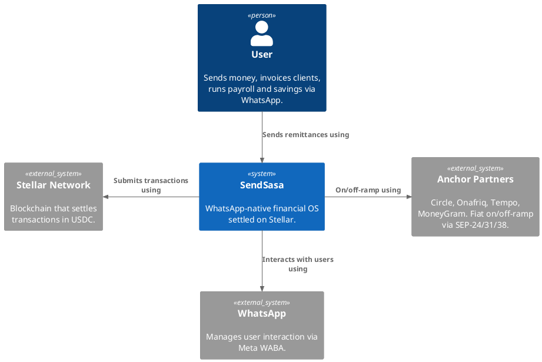
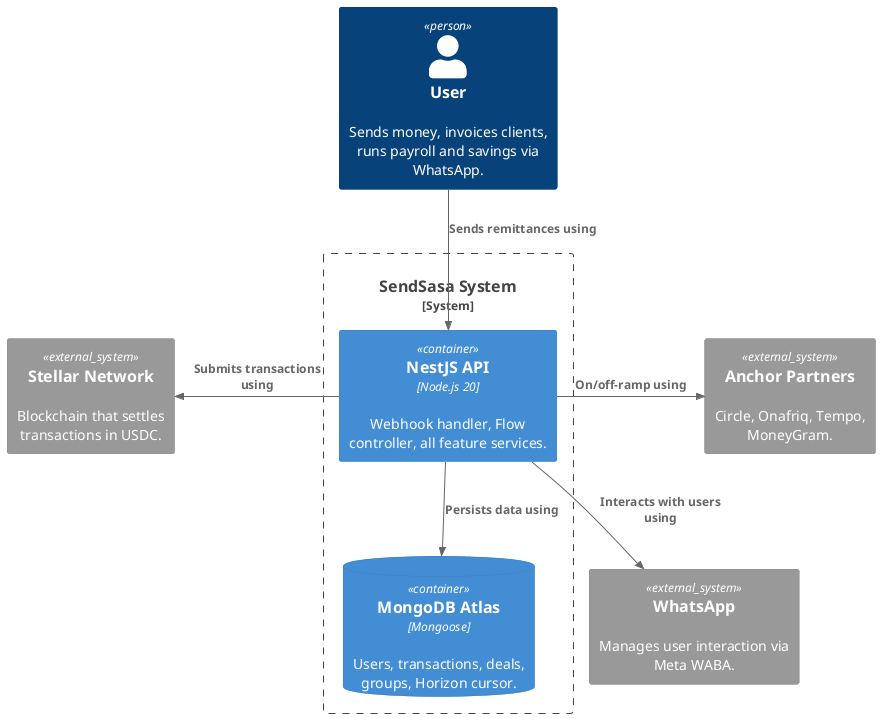

# Technical Architecture Document
# SendSasa

---

**Introduction** 1
High-Level Overview 1
Definitions, acronyms and abbreviations 2
Architecture constraints 2

**Architecture Overview** 3
C4 L1 Diagram: High-Level Architecture 3
C4 L2 Diagram: Zoom into the SendSasa System 3

**Deliverables** 4
Deliverable 1 (Already done) 4
Deliverable 2 5
Deliverable 3 6
Deliverable 4 7
Deliverable 5 8
Deliverable 6 9
Deliverable 7 10
Deliverable 8 11
Deliverable 9 12

**Stack** 13

---

# Introduction

## High-Level Overview

SendSasa is a WhatsApp-native financial operating system built for the African diaspora and their families and business partners on the continent. Every financial operation — sending money across borders, locking funds in escrow, running payroll, participating in a rotating savings circle, splitting group expenses, or invoicing a European client — flows entirely through a WhatsApp conversation. No app download, no crypto wallet, no bank account is required on either end.

The platform is built on Stellar as its settlement layer. Senders fund transfers through Circle's SEP-24 hosted on-ramp (ACH, Interac, SEPA), which issues USDC on Stellar. From there, `pathPaymentStrictSend` routes funds to Onafriq's SEP-31 receiving anchor, which delivers XAF directly to any MTN MoMo or Orange Money wallet in Cameroon — all in under 60 seconds, at a fraction of wire transfer costs. For business users in Europe, SafiPay opens a EUR B2B invoicing corridor through Tempo's SEPA-to-EURT anchor on Stellar, completely eliminating correspondent banks from the African export payment chain.

Beyond remittance, SendSasa introduces five additional Stellar-powered financial primitives: TrustLock (marketplace escrow via a Soroban smart contract), NjangiBot (rotating savings circles where all members contribute via Circle SEP-24 and the cycle recipient receives XAF via Onafriq SEP-31), SplitChat (group collections), PayDay (batch payroll where 100 employees are paid in a single Stellar transaction), and SafiPay (SME invoicing with EUR B2B collection via the Tempo anchor). All six features share the same Stellar wallet, the same Horizon event indexer, and the same SEP anchor stack — making SendSasa the first full-featured financial operating system for Francophone Africa to run on Stellar rails.

---

## Definitions, Acronyms and Abbreviations

| Term | Definition |
|---|---|
| **USDC** | USD Coin — dollar-pegged stablecoin issued by Circle on Stellar |
| **XAF** | Central African CFA franc — legal currency of the CEMAC zone (Cameroon, Congo, Gabon and 3 others) |
| **EURT** | Euro-backed stablecoin issued by Tempo on Stellar; used in the SafiPay EUR B2B corridor |
| **Stellar** | Public blockchain for fast, low-cost payments — ~5 second finality, ~$0.00002 per operation |
| **Soroban** | Stellar's Rust-based smart contract platform |
| **SEP** | Stellar Ecosystem Proposal — interoperability standards for anchors and wallets |
| **SEP-10** | WebAuth — authentication protocol; produces a JWT for anchor API calls |
| **SEP-12** | KYC API — `PUT /customer`; used to register recipients before SEP-31 off-ramp |
| **SEP-24** | Hosted Deposit/Withdrawal — anchor hosts the payment UI; returns an interactive URL |
| **SEP-31** | Cross-Border Payments — `POST /transactions`; anchor delivers local currency to recipient's mobile wallet |
| **SEP-38** | Anchor RFQ — indicative prices (`GET /price`) and firm quotes (`POST /quote`) with `expires_at` |
| **Horizon** | Stellar's HTTP and streaming API at `horizon.stellar.org` |
| **Horizon Cursor** | `paging_token` on each Horizon event; persisted to MongoDB so the stream resumes exactly where it left off after reconnect |
| **pathPaymentStrictSend** | Stellar operation that sends a fixed amount through SDEX/AMM paths; atomic multi-hop |
| **Sponsored Reserves** | Protocol 15 feature where the platform pays the 0.5 XLM base reserve for user accounts |
| **Fee-Bump** | Outer transaction wrapper that pays fees from the platform keypair so users never need XLM |
| **SDEX** | Stellar Decentralised Exchange — built-in atomic order book |
| **SAC** | Stellar Asset Contract — canonical Soroban wrapper for a classic Stellar asset (e.g. USDC) |
| **Onafriq** | Africa's largest mobile money gateway; Circle USDC partner; SEP-31 receiving anchor for the XAF off-ramp |
| **Tempo** | French MiCA-licensed EMI; EURT issuer on Stellar; SEP-24 SEPA anchor for the EUR B2B corridor |
| **Circle** | USDC issuer; SEP-10 + SEP-24 on-ramp anchor at `circle.stellar.org` |
| **MoneyGram** | Cash-pickup backup off-ramp via SEP-24 withdrawal; 400,000+ agent locations in 175 countries |
| **MoMo** | Mobile Money |
| **WhatsApp Flows** | Meta's encrypted, multi-step in-chat forms; strict JSON schema type validation |

---

## Architecture Constraints

- XAF amounts must be integers — `Math.round()` applied before every anchor call
- WhatsApp Flows endpoints require HTTPS — Meta validates TLS on every Flow data exchange request
- Stellar state is event-driven — all state updates are driven by Horizon streaming or Soroban event polling, never by a polling timer
- Callback and webhook handlers must return HTTP 200 immediately; all processing happens asynchronously after the response
- The platform Stellar secret key is stored only in a secrets manager and never appears in logs or code
- Stellar batch transactions are capped at 100 operations — PayDay payrolls above 100 recipients are chunked into sequential Fee-Bumped batches
- SEP-38 firm quotes carry an `expires_at` timestamp — if `pathPaymentStrictSend` returns `op_under_dest_min`, the system must re-quote and re-notify the user before retrying
- Horizon event cursors are persisted to MongoDB before any business logic runs — guaranteeing exactly-once processing on reconnect
- Soroban events are retained on-chain for 7 days — `pollContractEvents()` must run continuously with no gap longer than 7 days
- Users hold zero XLM — all base reserves and transaction fees are paid by the platform via Sponsored Reserves and Fee-Bump transactions

---

# Architecture Overview

## C4 L1 Diagram: High-Level Architecture

This high-level diagram shows the system's broader context, depicting its interactions with external entities such as senders, recipients, and Stellar anchor partners.

## C4 L2 Diagram: Zoom into the SendSasa System

This diagram illustrates a more technical overview of the SendSasa system and how its internal components interact.

---

# Deliverables

---

## Deliverable 1 (Already done)

### User Story 1: Bot Introduction and Onboarding

**As a** user, **I want** to receive a welcome message and set up my SendSasa account via WhatsApp, **so that** I can start sending and receiving money without downloading any app.

**Acceptance Criteria:**
- **Given** the user has sent their first message to the SendSasa WhatsApp number,
  **When** the bot receives it,
  **Then** the bot should respond with a welcome message and prompt the user to create a 5-digit PIN via a WhatsApp Flow.
- **Given** the user completes PIN setup,
  **When** the Flow data exchange completes,
  **Then** the system creates a User record in MongoDB, provisions a Stellar wallet, and sends a confirmation message.

### User Story 2: Main Menu

**As a** user, **I want** to see all available financial features from a single menu, **so that** I can navigate to any feature without needing to remember commands.

**Acceptance Criteria:**
- **Given** the user sends "menu" or any unrecognised message,
  **When** the bot receives it,
  **Then** the bot sends an interactive list menu containing: Send Money, TrustLock, NjangiBot, SplitChat, PayDay, SafiPay.
- **Given** the user selects any feature from the menu,
  **When** the selection is received,
  **Then** the bot routes to the correct feature handler and opens the appropriate WhatsApp Flow.

---

## Deliverable 2

### User Story 1: Stellar Wallet Provisioning with Sponsored Reserves

**As a** user, **I want** a Stellar wallet created automatically when I register, **so that** I can send and receive USDC without knowing anything about blockchain or needing to buy XLM.

**Acceptance Criteria:**
- **Given** a new user completes WhatsApp onboarding,
  **When** the system provisions their Stellar account,
  **Then** the platform derives a deterministic Ed25519 keypair from the user's Web3Auth key material and stores the public key on the User record.
- **Given** the keypair is derived,
  **When** the account is created on Stellar,
  **Then** the system submits a 3-operation sponsored transaction: `beginSponsoringFutureReserves` → `changeTrust(USDC)` → `endSponsoringFutureReserves`, signed by both the platform keypair (sponsor) and the user keypair.
- **Given** the account creation transaction is submitted,
  **When** Horizon confirms it,
  **Then** the user holds zero XLM, the 0.5 XLM base reserve is sponsored by the platform, and the USDC trustline is active.
- **Given** any subsequent Stellar transaction for the user,
  **When** it is submitted,
  **Then** it is wrapped in a Fee-Bump transaction signed by the platform keypair so the user never pays fees in XLM.

### User Story 2: Live FX Quote via SEP-38

**As a** user, **I want** to see a live exchange rate before I commit to sending money, **so that** I know exactly how many XAF my recipient will receive.

**Acceptance Criteria:**
- **Given** the user opens the Send Money Flow,
  **When** they enter the amount to send,
  **Then** the system calls `GET /price?sell_asset=USDC&buy_asset=XAF&sell_amount=N` on the Onafriq SEP-38 endpoint and displays the indicative XAF amount in the Flow screen within 1 second.
- **Given** no `FIXER_API_KEY` is configured,
  **When** the FX service is called,
  **Then** the system falls back to a hardcoded rate of 612 XAF/USDC and the user sees a rate disclaimer.
- **Given** a live rate is available,
  **When** the rate is displayed,
  **Then** the screen shows "Rate: 1 USDC = [rate] XAF (live)" and a note that the rate is valid for 30 seconds.

---

## Deliverable 3

### User Story 1: Fiat On-Ramp via Circle SEP-24

**As a** sender, **I want** to fund my transfer using my bank account, debit card, or Interac e-Transfer, **so that** I can send money to Cameroon without owning any crypto first.

**Acceptance Criteria:**
- **Given** the user initiates a transfer,
  **When** the system prepares the on-ramp,
  **Then** it performs SEP-10 WebAuth with Circle's anchor: fetches the challenge XDR, signs it with the platform keypair, posts it back, and receives a JWT.
- **Given** the JWT is obtained,
  **When** the system calls Circle's `POST /transactions/deposit/interactive`,
  **Then** Circle returns an `{ id, url }` and the system sends the interactive URL to the user via WhatsApp: "💳 Complete your payment here: [url]".
- **Given** the user completes payment on the Circle-hosted page (ACH, debit card, Interac, or SEPA),
  **When** Circle processes the deposit,
  **Then** USDC appears in the platform's Stellar account and the Horizon event stream fires, triggering the next stage automatically.
- **Given** the Horizon indexer picks up the incoming USDC payment,
  **When** it is matched to the sender's pending transaction by memo,
  **Then** the system updates the transfer status and triggers the off-ramp flow.

---

## Deliverable 4

### User Story 1: Send Money to Cameroon via Stellar

**As a** sender who has funded their transfer, **I want** the USDC to be automatically converted and delivered to the recipient's mobile money wallet in Cameroon, **so that** my recipient receives XAF in their MTN MoMo or Orange Money account.

**Acceptance Criteria:**
- **Given** USDC has arrived in the platform's Stellar account following a Circle SEP-24 deposit,
  **When** the Horizon indexer fires `onDepositCompleted()`,
  **Then** the system calls Onafriq's SEP-12 `PUT /customer` with the recipient's phone number and country code and waits for `status: ACCEPTED`.
- **Given** the recipient KYC is accepted,
  **When** the system prepares the off-ramp,
  **Then** it calls SEP-38 `POST /quote` with a JWT to lock a firm XAF rate and receives `{ id, expires_at, buy_amount }`.
- **Given** the firm quote is obtained,
  **When** the system submits the Stellar transaction,
  **Then** it executes `pathPaymentStrictSend` with `sendAsset: USDC`, `destination: Onafriq distribution account`, `destMin: buy_amount` from the firm quote, and the Onafriq `stellar_memo` in the transaction memo field.
- **Given** the `pathPaymentStrictSend` is confirmed on Stellar,
  **When** Onafriq's webhook fires `status: completed`,
  **Then** the recipient receives XAF in their MoMo wallet and both sender and recipient receive a WhatsApp confirmation with receipt.
- **Given** `pathPaymentStrictSend` returns `op_under_dest_min` (quote expired),
  **When** the error is caught,
  **Then** the system automatically re-fetches a new firm quote, re-submits the transaction, and notifies the user of the refreshed rate.

---

## Deliverable 5

### User Story 1: TrustLock — Soroban Smart Contract Escrow

**As a** buyer making a marketplace purchase, **I want** to lock my payment in escrow until I confirm delivery, **so that** I never send money to a seller who doesn't deliver the goods.

**Acceptance Criteria:**
- **Given** the buyer opens the TrustLock Flow and fills in the deal title, amount, and seller's phone number,
  **When** the Flow completes,
  **Then** the system generates a unique deal short code, creates a Deal record in MongoDB, and initiates a Circle SEP-24 deposit for the required USDC amount.
- **Given** the Circle deposit completes and USDC arrives in the platform account,
  **When** the Horizon indexer fires,
  **Then** the system invokes the Soroban TrustLock contract's `lock(client, provider, amount, token)` function via `Client.from()`, using the SAC (Stellar Asset Contract) for USDC. The deal status is updated to `ACTIVE` and the seller is notified via WhatsApp.
- **Given** the buyer receives the goods and confirms delivery via WhatsApp,
  **When** the buyer taps the confirmation button,
  **Then** the system invokes `release(client)` on the Soroban contract, which transfers `(amount − 1% fee)` in USDC to the seller's Stellar account and the fee to the platform. The seller is notified via WhatsApp.
- **Given** the buyer does not confirm or deny within 72 hours,
  **When** `env.ledger().timestamp() > lock_time + 259_200`,
  **Then** any party may call `auto_release()` — a permissionless function on the contract — which releases funds to the seller automatically without requiring the platform.
- **Given** the buyer or seller files a dispute,
  **When** the dispute is submitted with reason and supporting evidence,
  **Then** the deal status changes to `DISPUTED`, the Gemini AI service analyses the evidence and returns `{ verdict: 'RELEASE' | 'REFUND' | 'MANUAL_REVIEW', confidence, reasoning }`, and the platform executes the appropriate contract call (`release` or `refund`).

### User Story 2: TrustLock — Seller Receives Payout via Onafriq

**As a** seller in Cameroon, **I want** to receive my payout in XAF mobile money after a deal is confirmed, **so that** I don't need a Stellar wallet or any crypto knowledge.

**Acceptance Criteria:**
- **Given** the Soroban contract's `release()` function sends USDC to the seller's Stellar account,
  **When** the Horizon indexer picks up the payment,
  **Then** the system automatically initiates an Onafriq SEP-31 off-ramp to deliver XAF to the seller's MoMo number.
- **Given** Onafriq fires `status: completed`,
  **When** the webhook is received,
  **Then** the seller receives a WhatsApp message: "✅ Deal complete — [amount] XAF has been sent to your MoMo wallet."

---

## Deliverable 6

### User Story 1: NjangiBot — Cross-Border Rotating Savings Circle

**As an** organiser of a tontine (njangi), **I want** to create a savings circle on WhatsApp where members contribute every cycle and each member receives the pooled amount in turn, **so that** the group can save collectively without a bank or intermediary.

**Acceptance Criteria:**
- **Given** the admin opens the NjangiBot Flow and configures the group (name, contribution amount, number of members, payout order),
  **When** the Flow completes,
  **Then** the system creates a Group record with a unique short code (e.g. NJ-A3B7C9) and sends invites to all members via WhatsApp.
- **Given** a member receives their invitation,
  **When** they choose to contribute,
  **Then** the system initiates a Circle SEP-24 deposit, sends the interactive URL to the member, and upon USDC arrival on Stellar marks the member's contribution as received.
- **Given** all members in the current cycle have contributed,
  **When** all USDC deposits are confirmed on Stellar,
  **Then** the system executes `pathPaymentStrictSend` → Onafriq SEP-31 to deliver the full cycle amount in XAF to the current recipient's MoMo wallet and advances `currentCycle`.
- **Given** the cycle payout completes,
  **When** Onafriq confirms delivery,
  **Then** all group members receive a WhatsApp summary: "🎊 Cycle [N] complete — [total XAF] sent to [recipient name]!"

### User Story 2: SplitChat — Group Expense Collection

**As a** group organiser, **I want** to collect contributions from multiple people for a shared expense, **so that** I receive the consolidated amount in one payout once everyone has paid.

**Acceptance Criteria:**
- **Given** the organiser opens the SplitChat Flow and sets the target amount, number of participants, and optional deadline,
  **When** the Flow completes,
  **Then** the system creates a Group record of type `SPLITCHAT` with a unique short code and sends the collection link to all participants via WhatsApp.
- **Given** participants contribute via Circle SEP-24,
  **When** the target USDC amount is reached on Stellar,
  **Then** the system initiates an Onafriq SEP-31 off-ramp to deliver the consolidated XAF to the organiser's MoMo wallet and all participants receive a WhatsApp confirmation.

---

## Deliverable 7

### User Story 1: PayDay — Batch Payroll on Stellar

**As a** business owner, **I want** to pay my entire team in a single WhatsApp message, **so that** I don't need to make individual transfers and my staff receive their salary the same day.

**Acceptance Criteria:**
- **Given** the employer types a natural language payroll instruction (e.g. "pay Jean 150000, Marie 200000, Paul 120000"),
  **When** the message is received,
  **Then** the Gemini AI service parses it and returns a structured `PayrollItem[]` list which is displayed to the employer for confirmation.
- **Given** the employer confirms the payroll,
  **When** the system prepares the Stellar disbursement,
  **Then** it builds a single `TransactionBuilder` with one `Operation.payment()` per recipient (up to 100 operations), where each destination is the Onafriq distribution account and each memo encodes `{phone}:{localAmount}` for Onafriq routing.
- **Given** the batch transaction is built,
  **When** it is wrapped in a Fee-Bump and submitted to Stellar,
  **Then** a single `stellarBatchTxHash` is saved to the Payroll record and Onafriq delivers XAF to each employee's MoMo wallet.
- **Given** Onafriq fires completion webhooks per recipient,
  **When** each is received,
  **Then** the corresponding `PayrollItem` status updates to `COMPLETED` and each employee receives a WhatsApp notification with their net amount.
- **Given** the payroll has more than 100 recipients,
  **When** the system builds the transaction,
  **Then** recipients are chunked into sequential Fee-Bumped batches of 100, each submitted after the previous one confirms on Stellar.

### User Story 2: SafiPay — EUR B2B Invoicing via Tempo Anchor

**As a** Cameroonian SME exporting goods to Europe, **I want** to send a payment link to my European client that accepts a SEPA bank transfer, **so that** I receive XAF in my mobile money wallet without either party needing a crypto wallet.

**Acceptance Criteria:**
- **Given** the merchant opens the SafiPay Flow and enters invoice details (client phone, description, amount, currency: EUR, due date),
  **When** the Flow completes,
  **Then** the system creates an Invoice record and performs SEP-10 WebAuth with the Tempo anchor to obtain a JWT.
- **Given** the JWT is obtained,
  **When** the system calls Tempo's SEP-24 `POST /transactions/deposit/interactive`,
  **Then** Tempo returns a SEPA payment link which the system sends to the European client's WhatsApp: "💶 Invoice [shortCode] — pay [amount] EUR here: [link]"
- **Given** the European client completes the SEPA transfer via the Tempo-hosted page,
  **When** Tempo issues EURT to the platform's Stellar account,
  **Then** the Horizon indexer fires and the system executes `pathPaymentStrictSend(EURT → USDC)` via the Stellar DEX in a single atomic hop using the fixed EUR/XAF peg (1 EUR = 655.957 XAF).
- **Given** the EURT → USDC swap completes on SDEX,
  **When** USDC is in the platform account,
  **Then** the system initiates an Onafriq SEP-31 off-ramp to deliver XAF to the merchant's MoMo wallet.
- **Given** Onafriq confirms delivery,
  **When** the webhook fires,
  **Then** the merchant receives a WhatsApp receipt: "✅ Invoice paid — [amount] XAF received in your MoMo wallet."

---

## Deliverable 8

### User Story 1: XAF Stellar Anchor — stellar.toml and Anchor Platform

**As a** developer building on Stellar, **I want** to be able to discover and use SendSasa's XAF anchor via the standard `stellar.toml` file, **so that** any Stellar wallet in the world can settle into the CEMAC zone without a custom integration.

**Acceptance Criteria:**
- **Given** SendSasa's XAF anchor is deployed,
  **When** a developer fetches `https://sendsasa.com/.well-known/stellar.toml`,
  **Then** the response is a valid TOML file containing `NETWORK_PASSPHRASE`, `SIGNING_KEY`, `WEB_AUTH_ENDPOINT`, `TRANSFER_SERVER_SEP0024`, `KYC_SERVER`, `ANCHOR_QUOTE_SERVER`, `FEDERATION_SERVER`, and a `[[CURRENCIES]]` block for XAF with `status="live"`.
- **Given** the anchor platform is running,
  **When** an external Stellar wallet performs SEP-10 WebAuth against `WEB_AUTH_ENDPOINT`,
  **Then** SendSasa returns a valid JWT that the wallet can use to initiate SEP-24 or SEP-31 transactions.
- **Given** the `stellar.toml` is published,
  **When** it is validated with `npx @stellar/anchor-tests --home-domain sendsasa.com`,
  **Then** all required fields pass and the anchor is eligible for listing on `anchors.stellar.org`.

### User Story 2: Federation

**As a** user, **I want** to have a human-readable Stellar address like `alice*sendsasa.com`, **so that** I can share it with anyone on Stellar instead of a long public key.

**Acceptance Criteria:**
- **Given** a user has a registered SendSasa account,
  **When** a Stellar wallet queries `https://sendsasa.com/federation?q=alice*sendsasa.com&type=name`,
  **Then** the federation server returns `{ account_id, memo_type, memo }` for that user.
- **Given** a payment is sent to `alice*sendsasa.com` on Stellar,
  **When** the Horizon indexer receives the payment with the correct memo,
  **Then** the user receives a WhatsApp notification: "💸 You received [amount] USDC."

---

## Deliverable 9

### User Story 1: Horizon Event Indexer — Real-Time Notifications

**As a** user, **I want** to receive an immediate WhatsApp notification the moment my transaction settles on Stellar, **so that** I know my money has arrived without needing to check anything.

**Acceptance Criteria:**
- **Given** the SendSasa backend starts,
  **When** `HorizonIndexerService.startStream()` is called in the `OnApplicationBootstrap` lifecycle hook,
  **Then** it opens a cursor-based Horizon payment stream for the platform account, resuming from the last saved `paging_token` in MongoDB.
- **Given** the stream is running,
  **When** a new USDC payment arrives on the platform's Stellar account,
  **Then** the system persists the cursor to MongoDB first (guaranteeing exactly-once processing on reconnect), then dispatches the event to the correct feature handler (Send Money, TrustLock, NjangiBot, PayDay, or SafiPay).
- **Given** a Horizon stream error occurs,
  **When** the connection drops,
  **Then** the stream automatically reconnects after 5 seconds using the last persisted cursor, with no missed events.
- **Given** the Soroban TrustLock contract is active,
  **When** `pollContractEvents()` runs every 30 seconds via `getEvents()` on the Soroban RPC,
  **Then** any `deal_locked`, `deal_released`, or `deal_refunded` contract events are ingested and deduplicated in MongoDB using the event ID, and the corresponding WhatsApp notifications are sent to buyer and seller.

### User Story 2: MoneyGram Ramps — Cash Pickup Off-Ramp

**As a** recipient in a location without mobile money coverage, **I want** to receive a cash pickup code via WhatsApp, **so that** I can collect my money at the nearest MoneyGram agent.

**Acceptance Criteria:**
- **Given** the sender selects "Cash pickup" as the delivery method,
  **When** the system prepares the off-ramp,
  **Then** it calls MoneyGram Ramps (SEP-24 withdrawal) via the Stellar anchor protocol and receives a reference code.
- **Given** MoneyGram confirms the transaction,
  **When** the withdrawal is ready,
  **Then** the recipient receives a WhatsApp message with the pickup reference code and nearest agent location.
- **Given** the MoneyGram agent network is available,
  **When** the recipient presents the code,
  **Then** they receive local currency cash at any of the 400,000+ MoneyGram agent locations across 175 countries.

---

# Stack

## Backend

**NestJS (Node.js 20, TypeScript)**
Modular framework with decorators and dependency injection. All WhatsApp, Stellar, and feature logic lives in domain-grouped NestJS modules.

**MongoDB Atlas (Mongoose)**
Primary database for Users, Transactions, Deals, Groups, Group Members, Payrolls, Invoices, Disputes, and the Horizon event cursor.

**`@stellar/stellar-sdk` v13.x**
Stellar transactions, Soroban contract invocations (`Client.from()`), Horizon streaming, SEP-10 WebAuth, and all `pathPaymentStrictSend` operations.

**Web3Auth**
Non-custodial wallet infrastructure. Derives deterministic Ed25519 keypairs for Stellar from a user's social login — users never manage private keys.

## Frontend

**WhatsApp (Meta WhatsApp Business Cloud API)**
The only user interface. All interactions happen through WhatsApp messages and WhatsApp Flows (encrypted, multi-step in-chat forms). No mobile app or website required.

## Infrastructure

**Render**
Hosts the NestJS backend as a Node.js native service. Auto-deploys from GitHub via deploy hook gated behind the CI pipeline.

**GitHub Actions CI/CD**
Six parallel jobs: `lint`, `typecheck`, `test`, `build`, `soroban-contracts` (cargo test), and `deploy` (triggers Render deploy hook on `main` only after all other jobs pass).

**MongoDB Atlas**
Managed cloud database with automatic backups and Atlas Search for transaction history queries.

## Automated Testing

**Jest & Supertest**
Unit tests for all service methods (FX conversion, fee calculation, SEP flow orchestration). Integration tests hit the Stellar Testnet — no mocks for payment rail calls.

**GitHub Actions CI/CD**
Runs the full test suite on every push and pull request. The `deploy` job is blocked until `lint`, `typecheck`, `test`, and `build` all pass.

**`@stellar/anchor-tests`**
Validates the `stellar.toml` and all SEP endpoint implementations before the XAF anchor goes live on mainnet.

## Integrations

**Stellar Network (Horizon + Soroban RPC)**
Settlement layer for all transactions. Horizon `horizon.stellar.org` for account management, transaction submission, streaming, and path discovery. Soroban RPC for TrustLock contract invocations and event queries.

**Circle (USDC SEP-24 Anchor)**
USD, CAD, and EUR on-ramp for senders. SEP-10 + SEP-24 hosted deposit flow at `circle.stellar.org`. USDC issuer: `GA5ZSEJYB37JRC5AVCIA5MOP4RHTM335X2KGX3IHOJAPP5RE34K4KZVN`.

**Onafriq (SEP-31 Receiving Anchor)**
Africa mobile money off-ramp. 500M+ wallets across 40 markets (MTN MoMo, Orange Money, M-Pesa, Airtel). Handles SEP-12 KYC, SEP-38 firm quotes, SEP-31 transaction initiation, and webhook callbacks. Single integration gives continent-wide MoMo coverage.

**Tempo Anchor**
French MiCA-licensed EMI. SEPA-to-EURT on Stellar via SEP-24. Powers the SafiPay EUR B2B invoicing corridor. EURT issuer: `GAP5LETOV6YIE62YAM56STDANPRDO7ZFDBGSNHJQIYGGKSMOZAHOOS73`. Fixed EUR/XAF peg: 655.957.

**MoneyGram Ramps**
Cash pickup off-ramp via SEP-24 withdrawal. 400,000+ agent locations in 175 countries. Backup delivery method for recipients without mobile money coverage.

**Meta WhatsApp Business Cloud API**
Primary user channel. Inbound messages handled via webhook. Outbound messages and WhatsApp Flows sent via the Graph API. All financial interactions are encrypted in-chat forms validated against strict JSON schemas.

**Google Gemini AI**
Two uses: (1) TrustLock dispute adjudication — returns `{ verdict: 'RELEASE' | 'REFUND' | 'MANUAL_REVIEW', confidence, reasoning }`; (2) PayDay natural language payroll parsing — converts a plain-text message into a structured `PayrollItem[]` list.
